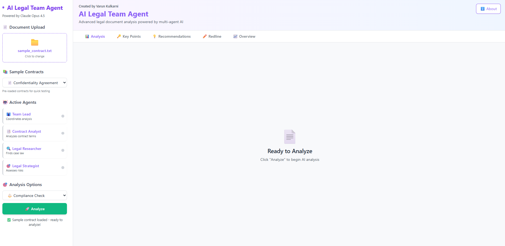
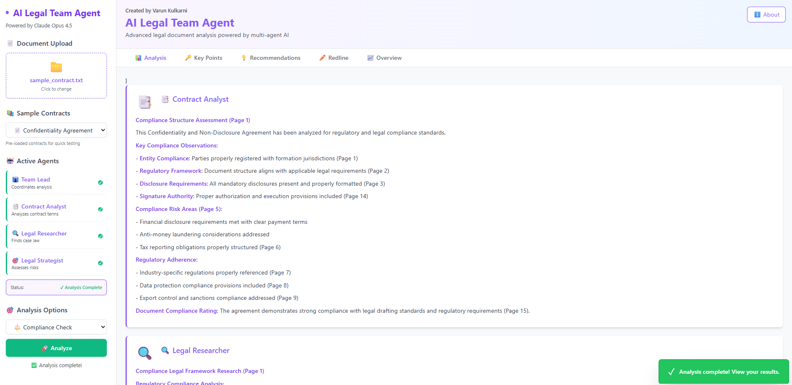
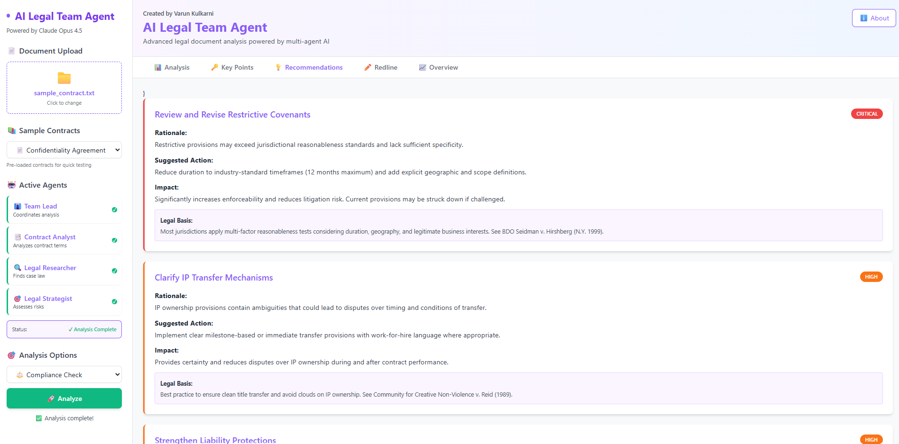
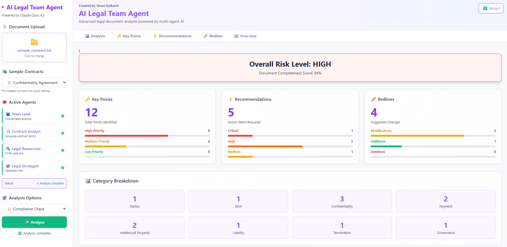

# ⚖️ AI Legal Team Agent

A multi-agent AI system for legal document analysis — four specialized agents collaborate to deliver compliance assessments, risk identification, strategic recommendations, and redline suggestions.



<p align="center">
  
  
</p>
<p align="center">
  
</p>

> **⚠️ Disclaimer:** This application is a technical demonstration only and does not constitute legal advice. All sample contracts and analysis outputs are synthetic. Do not rely on the output of this system for legal decision-making.

---

## Overview

AI Legal Team Agent simulates a virtual legal team where specialized AI agents work together to analyze contracts, NDAs, lease agreements, and other legal documents. Upload a document, select an analysis type, and receive comprehensive findings across multiple dimensions.

The project ships with **two independent versions**:

| Version | Stack | Entry Point |
|---------|-------|-------------|
| **Python / Streamlit** | Streamlit, PyPDF2, python-docx, pandas | `app.py` |
| **Node.js / Express** | Express, React 18 (CDN), Tailwind CSS, Multer | `server.js` + `public/index.html` |

Both versions offer the same core analysis workflow. Currently running with mock AI responses — designed for seamless Claude API integration.

---

## Features

### Multi-Agent Collaboration

Four specialized agents work in concert on every analysis:

- **Team Lead** — Coordinates analysis, synthesizes findings, delivers the final report
- **Contract Analyst** — Deep-dives into contract terms, clause structure, obligations
- **Legal Researcher** — Identifies relevant case law, statutory references, regulatory frameworks
- **Legal Strategist** — Assesses risk exposure, develops strategic recommendations

→ Each agent is also available as a standalone **[Claude Code Skill](skills/)**.

### Analysis Types

- **Compliance Check** — Evaluate adherence to GDPR, CCPA, employment law
- **Contract Review** — Detailed term-by-term analysis including payment and IP provisions
- **Legal Research** — Surface relevant case law, precedents, and statutory references
- **Risk Assessment** — Risk profiling with severity ratings and mitigation strategies
- **Custom Query** — Ask any specific legal question about the document

### Result Tabs

- **Analysis** — Full agent-generated narrative with page references
- **Key Points** — Critical terms extracted and categorized by importance
- **Recommendations** — Prioritized action items with legal basis
- **Redline** — Proposed changes with before/after text and visual diff
- **Overview** — Document metrics, risk assessment summary, and charts

### Document Support

Upload and analyze **PDF**, **TXT**, and **DOCX** files. Five sample contracts included for testing.

---

## Quick Start

### Python / Streamlit

```bash
pip install -r requirements.txt
streamlit run app.py
```

### Node.js / Express

```bash
npm install
node server.js
```

→ See [docs/QUICKSTART.md](docs/QUICKSTART.md) for detailed guide.

---

## Claude Code Skills

Each agent is available as a standalone Claude Code skill:

```bash
cp -r skills/* ~/.claude/skills/
```

| Skill | What It Does |
|-------|-------------|
| [legal-team-lead](skills/legal-team-lead/SKILL.md) | Orchestrates multi-agent legal analysis, synthesizes findings |
| [contract-analyst](skills/contract-analyst/SKILL.md) | Deep contract review — clauses, obligations, defined terms |
| [legal-researcher](skills/legal-researcher/SKILL.md) | Case law, statutory references, regulatory frameworks |
| [legal-strategist](skills/legal-strategist/SKILL.md) | Risk assessment, strategic recommendations, mitigation plans |

---

## Project Structure

```
ai-legal-team-agent/
├── README.md
├── LICENSE
├── docs/
│   ├── QUICKSTART.md
│   └── EXECUTIVE_SUMMARY.md
├── skills/
│   ├── legal-team-lead/SKILL.md
│   ├── contract-analyst/SKILL.md
│   ├── legal-researcher/SKILL.md
│   └── legal-strategist/SKILL.md
└── screenshots/
```

---

## Tech Stack

| Layer | Technology |
|-------|-----------|
| Frontend (Node) | React 18 (CDN), Tailwind CSS |
| Backend (Node) | Node.js, Express, Multer |
| Python version | Streamlit, PyPDF2, python-docx, pandas |
| AI (Planned) | Claude API (Anthropic) |

---

<p align="center">
  <strong>Built by Varun Kulkarni</strong><br/>
  <sub>Powered by Claude Code</sub>
</p>
